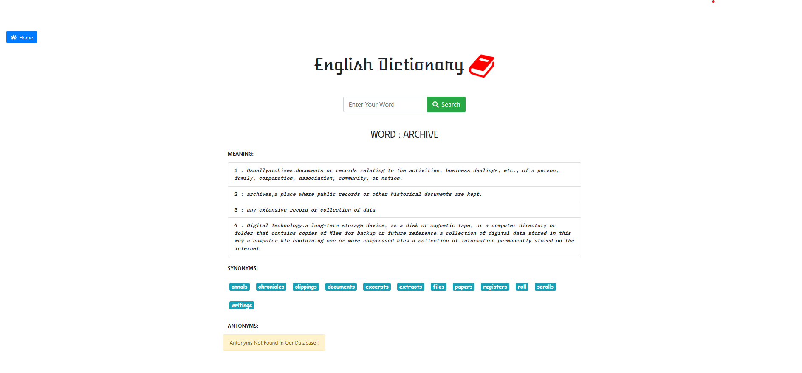
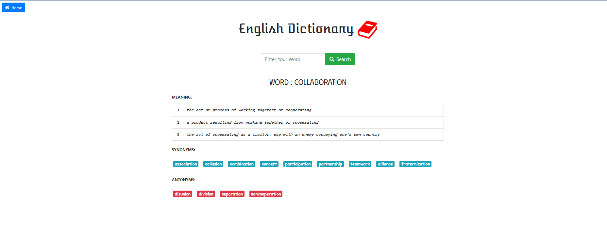
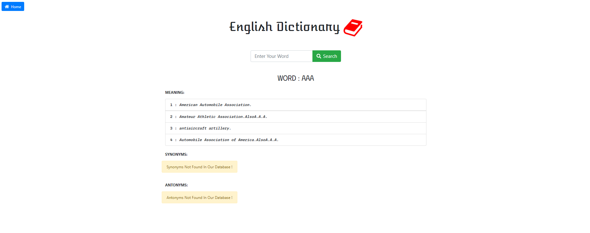
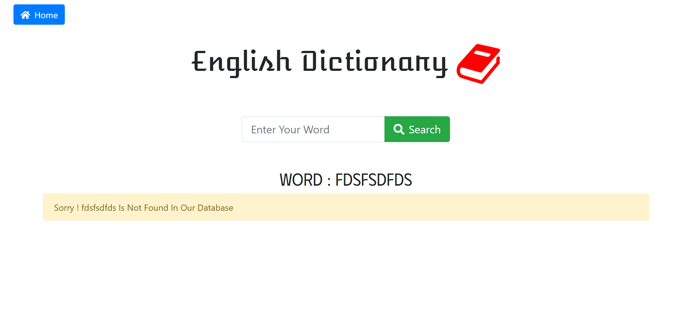
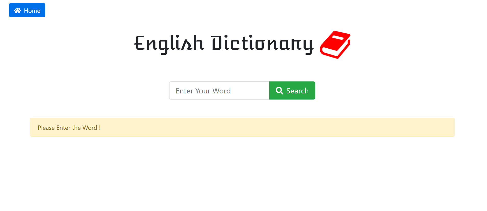
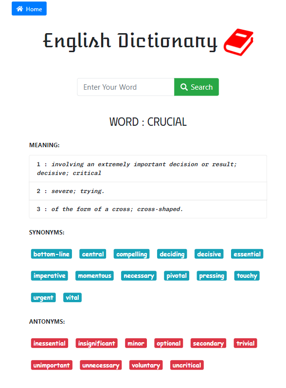

# DJANGO - ENGLISH DICTIONARY

## Table of Contents

- [Overview](#overview)
  - [Description](#description)
  - [Objectives](#objectives)
  - [Screenshot](#screenshot)
  - [Technical Skills](#technical-skills)
  - [Frameworks](#frameworks)
  - [Tools](#tools)
  - [Browsers](#browsers)
  - [Acknoledgement](#Acknowledgement)
- [Author](#author)
  - [Connect With Me](#connect-with-me)
  - [Github Stats](#github-stats)

## Overview

### Description

A English Dictionary App which provide meanings , synonyms and antonyms to the word search by user.

### Objectives

- Make a Django English Dictionary Project
- Routing in urls.py
- Create views for all functionalities
- Web Scrapping using BeautifulSoup
- Used Bootstrap for the UI.

### Screenshot

 
 
 
 
 
 
 

### Technical Skills

 

### Frameworks

### Operating System

 

### Tools

 

### Browsers

## Authors

### Connect With Me

 
 

### GitHub Stats

